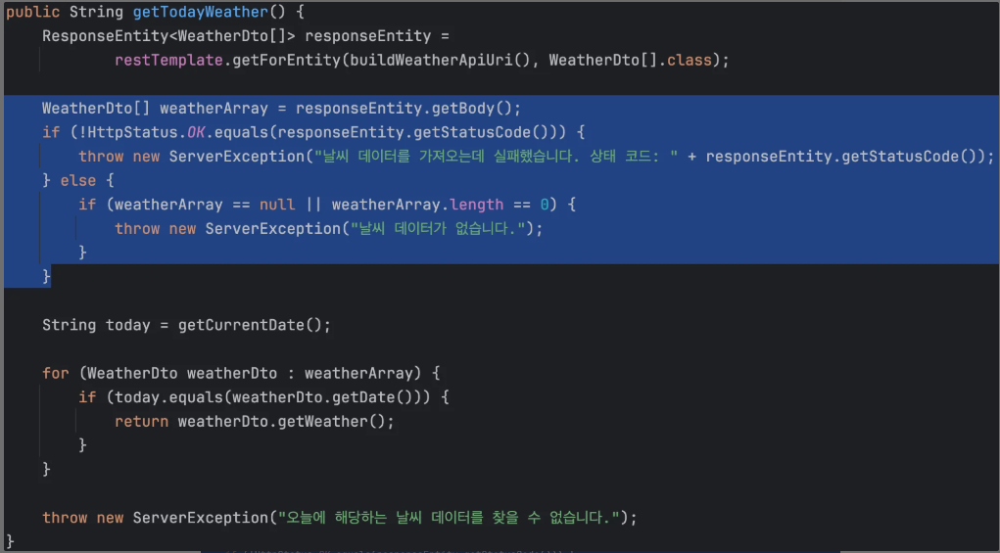
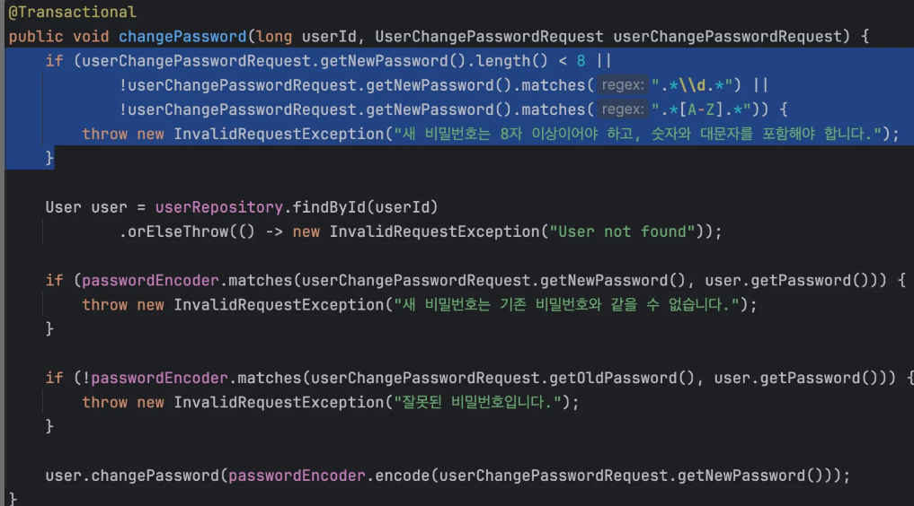
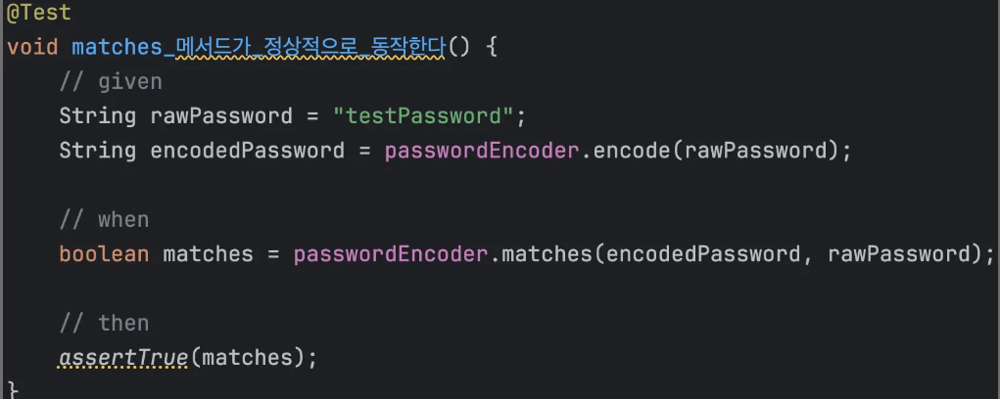
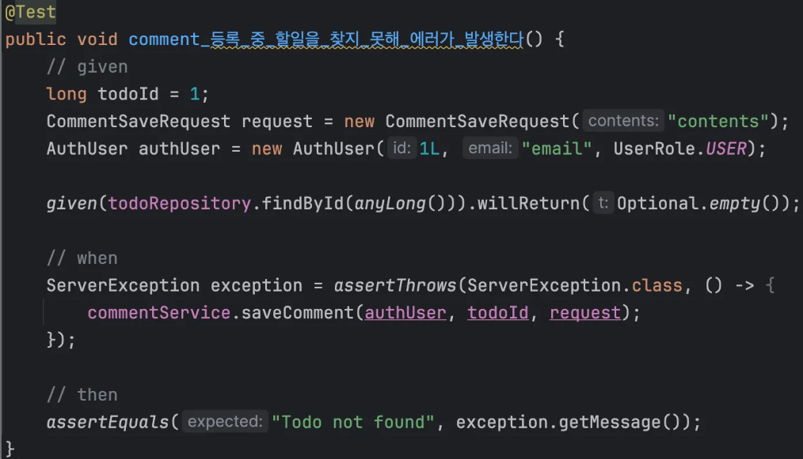
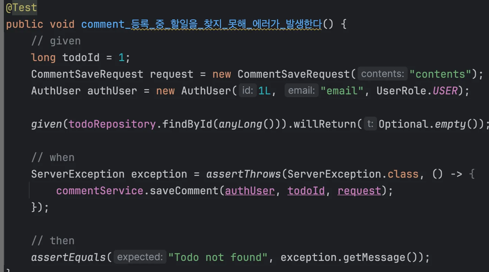
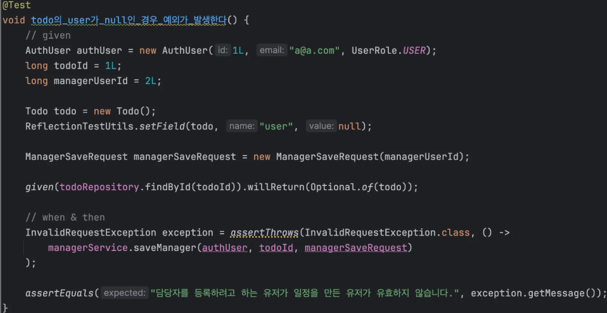

# 📖 SPRING ADVANCED

## 💠개요

기존 만들어진 코드를 분석하면서 수정해나가는 과제입니다

---

## 요구사항

## #️⃣ 필수

## ⏹️ 코드 개선 퀴즈 - Early Return
조건에 맞지 않는 경우 즉시 리턴하여, 불필요한 로직의 실행을 방지하고 성능을 향상시킵니다.

## 📌 수정

```java
 if (userRepository.existsByEmail(signupRequest.getEmail())) {
            throw new InvalidRequestException("이미 존재하는 이메일입니다.");
        }

        String encodedPassword = passwordEncoder.encode(signupRequest.getPassword());

        UserRole userRole = UserRole.of(signupRequest.getUserRole());
```
제일 상단으로 올려주면서 해결했다

## ⏹️ 리팩토링 퀴즈 - 불필요한 if-else 피하기

복잡한 if-else 구조는 코드의 가독성을 떨어뜨리고 유지보수를 어렵게 만듭니다. 불필요한 else 블록을 없애 코드를 간결하게 합니다.



## 📌 수정
```java
   if (!HttpStatus.OK.equals(responseEntity.getStatusCode())) {
            throw new ServerException("날씨 데이터를 가져오는데 실패했습니다. 상태 코드: " + responseEntity.getStatusCode());
        }
        if (weatherArray == null || weatherArray.length == 0) {
            throw new ServerException("날씨 데이터가 없습니다.");
        }
```
else 제거 후 분리 <br>


## ⏹️ 코드 개선 퀴즈 - Validation

아래 코드 부분을 해당 API의 요청 DTO에서 처리할 수 있게 개선해주세요.



## 📌 수정

DTO에 해당 어노테이션 추가
```java
    @Size(min = 8)
    @Pattern(regexp = "^(?=.*[a-z])(?=.*[A-Z])(?=.*[0-9]).*$", message = "새 비밀번호는 8자 이상이어야 하고, 숫자와 대문자를 포함해야 합니다.")
    private String newPassword;
```


## ⏹️ Lv 2. N+1 문제

- [ ] TodoController와 TodoService를 통해 Todo 관련 데이터를 처리합니다.
- [ ] 여기서 N+1 문제가 발생할 수 있는 시나리오는 getTodos 메서드에서 모든 Todo를 조회할 때, 각 Todo와 연관된 엔티티를 개별적으로 가져오는 경우이고 현재 특정 기능을 활용해서 N+1 발생을 방지한 상태입니다.
- [ ] JPQL 특정 기능을 사용하여 N+1 문제를 해결하고 있는 `TodoRepository`가 있습니다. 해당 Repository가 어떤 기능을 활용해서 N+1을 해결하고 있는지 분석 해보세요.
- 이를 동일한 동작을 하는 `@EntityGraph` 기반의 구현으로 수정해주세요.

## 📌 수정

지연로딩 설정되있어서 연관된 엔티티 값을 가져오기 위해
여러번 조회해야 하는 문제가 있음 -> N+1 발생 가능성
> 한 번에 가져오기 위해 join fetch 사용

```java
    @EntityGraph(attributePaths = {"user"})
    Page<Todo> findAllByOrderByModifiedAtDesc(Pageable pageable);
```


## ⏹️ Lv 3. 테스트코드 연습
### 1. 테스트 패키지 package org.example.expert.config; 의 PassEncoderTest 클래스에 있는 matches_메서드가_정상적으로_동작한다() 테스트가 의도대로 성공할 수 있게 수정해 주세요.

## 📌 수정
 매개변수 위치 문제였음 바꿔주면 해결

```java
   @Test
    void matches_메서드가_정상적으로_동작한다() {
        // given
        String rawPassword = "testPassword";
        String encodedPassword = passwordEncoder.encode(rawPassword);

        // when
        boolean matches = passwordEncoder.matches(rawPassword, encodedPassword);

        // then
        assertTrue(matches);
```

### 2. 예상대로 예외처리 하는지에 대한 케이스

## 📌 수정

NPE가아닌 IRE에러 오류메시지 수정

```java
    @Test
    public void manager_목록_조회_시_Todo가_없다면_IRE_에러를_던진다() {
        // given
        long todoId = 1L;
        given(todoRepository.findById(todoId)).willReturn(Optional.empty());

        // when & then
        InvalidRequestException exception = assertThrows(InvalidRequestException.class, () -> managerService.getManagers(todoId));
        assertEquals("Todo not found", exception.getMessage());
    }
```
### 3.  테스트 코드를 잘못 작성했어요!

## 📌 수정
ServerException > InvalidRequestException로 수정

```java
    @Test
    public void comment_등록_중_할일을_찾지_못해_에러가_발생한다() {
        // given
        long todoId = 1;
        CommentSaveRequest request = new CommentSaveRequest("contents");
        AuthUser authUser = new AuthUser(1L, "email", UserRole.USER);

        given(todoRepository.findById(anyLong())).willReturn(Optional.empty());

        // when
        InvalidRequestException exception = assertThrows(InvalidRequestException.class, () -> {
            commentService.saveComment(authUser, todoId, request);
        });

        // then
        assertEquals("Todo not found", exception.getMessage());
    }
```
### 4. 테스트가 성공할 수 있도록 **서비스 로직**을 수정해 주세요.

## 📌 수정
nullSafeEquals는 비교하는 값이 null여도 안전하지만 내부에서 발생하는 null은 잡지 못함
즉 todo.getUser에서 user가 null인데 참조할려하므로 NPE발생 이건 막아주지못함 
그래서 todo.getUser Null체크가 필수다

```java
        User user = User.fromAuthUser(authUser);
        Todo todo = todoRepository.findById(todoId)
            .orElseThrow(() -> new InvalidRequestException("Todo not found"));

        if (!ObjectUtils.nullSafeEquals(user.getId(),
            Optional.ofNullable(todo.getUser()).map(User::getId).orElse(null))) {
            throw new InvalidRequestException("담당자를 등록하려고 하는 유저가 일정을 만든 유저가 유효하지 않습니다.");
        }
```

## 2️⃣ 도전

⏹️ LV4. Interceptor와 AOP를 활용한 API 로깅


- [ ] **Interceptor**를 사용하여 구현하기
    - 요청 정보(`HttpServletRequest`)를 사전 처리합니다.
    - 인증 성공 시, 요청 시각과 URL을 로깅하도록 구현하세요.

```java
@Configuration
@RequiredArgsConstructor
public class WebConfig implements WebMvcConfigurer {

    // ArgumentResolver 등록
    @Override
    public void addArgumentResolvers(List<HandlerMethodArgumentResolver> resolvers) {
        resolvers.add(new AuthUserArgumentResolver());
    }

    @Override
    public void addInterceptors(InterceptorRegistry registry) {
        registry.addInterceptor(new UserAuthInterceptor())
            .addPathPatterns("/admin/*");
    }
}

@Override
public boolean preHandle(HttpServletRequest request, HttpServletResponse response,
    Object handler) throws Exception {

    log.info(" 요청 url -> {} ",request.getRequestURI());
    log.info(" 요청 시각 -> {} ", LocalDateTime.now());

    return true;
}


```
필터에서 /admin에 대해서 인가 체크 하기에 로그 출력만 추가


- [ ]  **AOP**를 사용하여 구현하기
    - 어드민 API 메서드 실행 전후에 요청/응답 데이터를 로깅합니다.
    - 로깅 내용에는 다음이 포함되어야 합니다:
        - 요청한 사용자의 ID
        - API 요청 시각
        - API 요청 URL
        - 요청 본문(`RequestBody`)
        - 응답 본문(`ResponseBody`)
- [ ] **세부 구현 가이드**
    - **Interceptor**:
        - 어드민 인증 여부를 확인합니다.
    - **AOP**:
        - `@Around` 어노테이션을 사용하여 어드민 API 메서드 실행 전후에 요청/응답 데이터를 로깅합니다.
        - 요청 본문과 응답 본문은 JSON 형식으로 기록하세요.
    - 로깅은 `Logger` 클래스를 활용하여 기록합니다.

```java
package org.example.expert.config;

import com.fasterxml.jackson.databind.ObjectMapper;
import jakarta.servlet.http.HttpServletRequest;
import java.time.LocalDateTime;
import java.util.HashMap;
import java.util.Map;
import java.util.Objects;
import lombok.extern.slf4j.Slf4j;
import org.aspectj.lang.ProceedingJoinPoint;
import org.aspectj.lang.annotation.Around;
import org.aspectj.lang.annotation.Aspect;
import org.springframework.stereotype.Component;
import org.springframework.web.context.request.RequestContextHolder;
import org.springframework.web.context.request.ServletRequestAttributes;

@Slf4j
@Aspect //	이 클래스는 AOP 기능을 가진 클래스임을 명시
@Component
public class AuthAspect {

    //org.example.expert.domain.user.controller.UserAdminController.changeUserRole()

    /**
     * 설명 @Around * -> 와일드 카드 모든 값 리턴 즉 Object org.뭐시기 -> 경로, deleteComment(..)의 .. 와일드 카드 0개 이상의 매개변수
     *
     * @param point 대상 메서드 실행을 제어할 때 사용
     * @return 응답 본문
     */
    @Around(
        "execution(* org.example.expert.domain.comment.controller.CommentAdminController.deleteComment(..))"+
            "execution(* org.example.expert.domain.user.controller.UserAdminController.changeUserRole(..))"
    )
    public Object authCheckUserLog(ProceedingJoinPoint point) throws Throwable {
        Map<String,Object> map = new HashMap<>();
        map.put("id",point.getArgs());
        if("changeUserRole".equals(point.getSignature().getName())){
            map.put("data",point.getArgs()[1]);
        }
        return setLog(point, map);
    }

    /**
     * log 출력 해주는 메소드
     * @param point 대상 메서드 실행을 제어하기 위해 받아옴
     * @return 응답 본문
     * @throws Throwable 뭘까
     */
    public Object setLog(ProceedingJoinPoint point,Map<String,Object> map) throws Throwable {
        // 타겟 메소드 실행전
        HttpServletRequest request = // 스프링이 현재 요청 컨텍스트에서 자동으로 꺼내줌
            ((ServletRequestAttributes) Objects.requireNonNull(
                RequestContextHolder.getRequestAttributes())).getRequest();

        ObjectMapper objectMapper = new ObjectMapper();//json변환
        Object[] arg = point.getArgs();

        log.info("요청한 사용자의 ID -> {}", arg[0]); // 대상 메소드의 매개변수에 들어온 값 가져옴 배열형태
        log.info("API 요청 시각 -> {}", LocalDateTime.now());
        log.info("API 요청 URL -> {}", request.getRequestURI());
        log.info("요청 본문 -> {}", objectMapper.writeValueAsString(map));

        map.clear();// 맵 초기화

        Object responseObj = point.proceed(); // 대상 메소드 실행

        log.info("응답 본문 -> {}", objectMapper.writeValueAsString(map.put("data",responseObj))); // 타겟 메소드 실행 후

        return responseObj;

    }
}
 
 ```
around로 2개의 메소드에 대해서만 동작 map에 넣고 json 변환 하는 식으로 json format맞춰서 출력